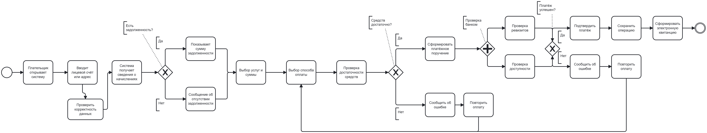
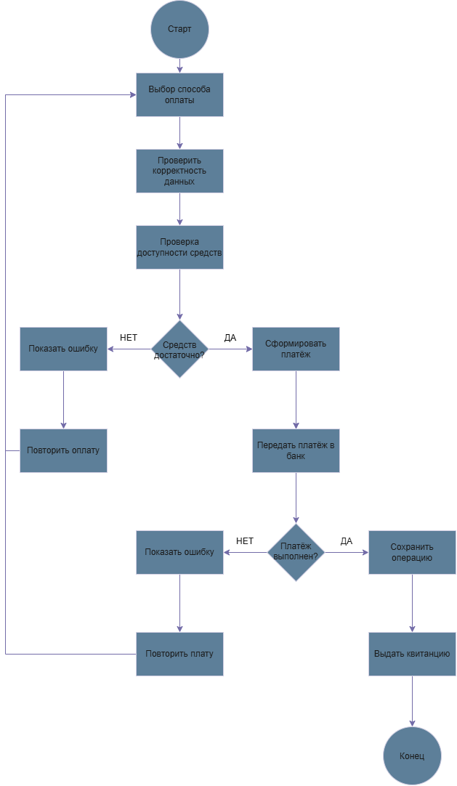

Название: Оплата коммунальных услуг.
Участники: плательщик, система коммунальных платежей, банк.
Процесс начинается с открытия плательщиком системы и ввода лицевого счёта или адреса. 
Система получает сведения о начислениях и проверяет наличие задолженности. 
Если задолженность имеется, пользователю отображается её сумма, после чего он выбирает необходимые услуги и сумму оплаты. 
Если задолженности нет, система сообщает об этом и также переводит пользователя к выбору услуг. 
Далее плательщик выбирает способ оплаты, а система проверяет наличие достаточных средств. 
Если средств недостаточно, система сообщает об ошибке и предлагает повторить операцию. 
Если средств достаточно, формируется платёжное поручение. 
После этого банк параллельно проверяет реквизиты платежа и доступность операции. 
При успешной проверке банк подтверждает платёж, а система сохраняет информацию об операции и формирует электронную квитанцию. 
Если платёж выполнить не удалось, система сообщает об ошибке и предлагает повторить оплату.

Вывод: Научился пользоваться git, создавать диаграммы процессов. 
По моему мнению, для обычного пользователя удобнее всего использовать Sequence Diagram, так как досточно удобное описание происходящих процессов.
